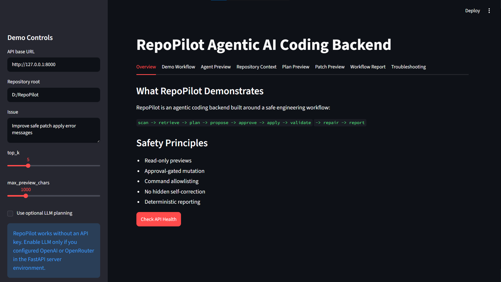
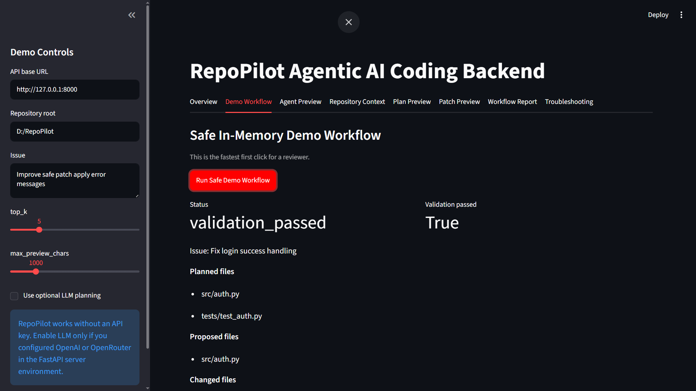
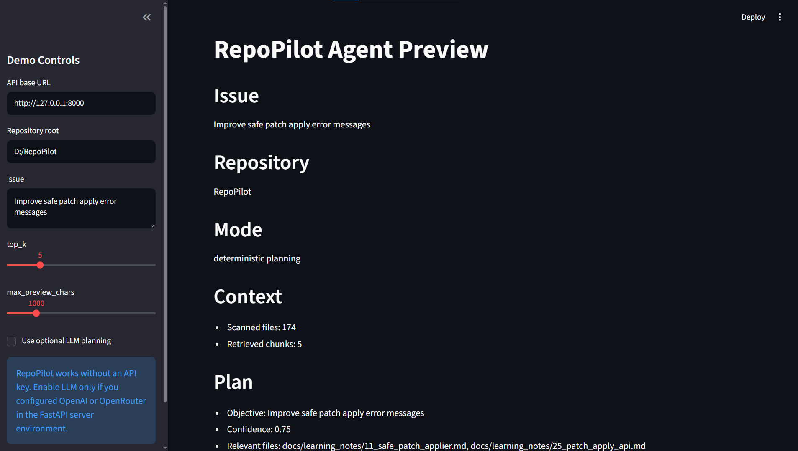

# RepoPilot

<p align="center">
  <b>Your AI-powered repository co-pilot for exploring, understanding, and presenting codebases faster.</b>
</p>

<p align="center">
  <a href="#overview">Overview</a> •
  <a href="#live-demo">Live Demo</a> •
  <a href="#features">Features</a> •
  <a href="#quick-start">Quick Start</a> •
  <a href="#architecture">Architecture</a> •
  <a href="#testing--quality">Testing</a> •
  <a href="#roadmap">Roadmap</a>
</p>

<p align="center">
  
  
  
  
  
  
</p>

---

## Overview

**RepoPilot** is a developer-focused repository analysis tool designed to help users understand software projects faster.

Instead of manually opening dozens of files, searching through folders, guessing architecture decisions, or trying to understand how a codebase works from scratch, RepoPilot gives users a clean, guided way to inspect a repository and generate useful project insights.

The project is built with a strong focus on:

- **Fast local setup**
- **Clean public demo experience**
- **No required API key for the default demo path**
- **Optional LLM-powered analysis**
- **Backend/frontend separation**
- **Reliable testing and code quality**
- **Portfolio-ready presentation**

RepoPilot is especially useful for:

- Developers joining a new project
- Students documenting graduation projects
- Recruiters or reviewers checking a repository quickly
- Teams that want a quick codebase overview
- AI-assisted development workflows
- Public demos where the app should work without private credentials

---

## Why RepoPilot?

Understanding a new repository can be painful.

A developer usually needs to answer questions like:

- What does this project do?
- Where is the main entry point?
- How is the code organized?
- What are the important files?
- How do I run it?
- What parts are backend, frontend, tests, or documentation?
- Is there any AI/LLM support?
- Can I safely demo this project without exposing secrets?

RepoPilot is designed to solve this problem by acting as a **repository co-pilot**.

It helps transform a raw codebase into a clearer, more understandable project experience.

---

## Live Demo

> Add your deployed demo link here after deployment.

```txt
Demo URL: https://your-demo-link.vercel.app
Backend URL: https://your-backend-link.onrender.com
```

RepoPilot supports a public-friendly demo mode by default.

That means the project can be shown to users, recruiters, teachers, or teammates without requiring them to provide an OpenAI key or any private credentials.

---

## Demo Mode

RepoPilot includes a **deterministic no-key demo mode**.

This is the default public path.

### What this means

Users can open the project and test the core experience without needing:

- OpenAI API key
- OpenRouter API key
- Paid LLM account
- Private `.env` file
- Secret configuration

This makes RepoPilot safer and easier to share publicly.

### Optional LLM Support

LLM support is still available, but it is clearly optional.

Users who want enhanced AI-powered analysis can configure their own API key locally.

The project keeps the default experience safe for public demos while still allowing advanced users to enable AI features.

---

## Features

### Repository Understanding

RepoPilot helps users inspect and understand a codebase by presenting repository information in a structured and user-friendly way.

It can be used to identify:

- Project structure
- Important directories
- Main application files
- Backend and frontend separation
- Documentation files
- Test files
- Configuration files
- Environment examples
- Public demo readiness

---

### Public Demo Ready

RepoPilot is designed to be demoed safely.

The app avoids depending on private credentials for its default experience and provides a clear no-key path for reviewers.

This is important because many portfolio projects fail during demos due to missing API keys, broken `.env` files, or hidden local-only assumptions.

RepoPilot avoids that by keeping the public demo deterministic and predictable.

---

### Optional AI Integration

RepoPilot supports optional AI/LLM functionality for deeper repository analysis.

The project can be configured with providers such as:

- OpenAI
- OpenRouter

However, these providers are not required for the default demo flow.

This makes the project flexible:

- Beginners can run it immediately.
- Reviewers can test it without setup pain.
- Advanced users can enable LLM features when needed.

---

### FastAPI Backend

The backend is powered by **FastAPI**, giving the project:

- Fast API performance
- Clean endpoint structure
- Modern Python backend architecture
- Easy local development
- Interactive API docs
- Simple integration with frontend clients

FastAPI is a strong choice for RepoPilot because the project needs a reliable API layer that can serve repository analysis results to the frontend.

---

### Streamlit Frontend

The frontend is built with **Streamlit**, making the interface:

- Simple to run locally
- Fast to prototype
- Easy to demo
- Suitable for internal tools and AI apps
- Friendly for non-technical reviewers

Streamlit works well for RepoPilot because the goal is to present repository insights clearly without overcomplicating the UI layer.

---

### Testing and Quality

RepoPilot includes a strong test suite and code quality checks.

Current validation result:

```txt
438 passed, 1 warning
```

Linting result:

```txt
All checks passed!
```

This gives confidence that the project is not just a prototype, but a tested and maintainable codebase.

---

### Security-Aware Setup

RepoPilot is prepared for public sharing.

The project includes:

- `.env` ignored in `.gitignore`
- `.env.example` with placeholder keys only
- No real-looking secret keys committed
- Optional API configuration
- Safe public demo defaults

This helps avoid one of the most common mistakes in AI projects: accidentally exposing API keys.

---

## Tech Stack

| Layer | Technology | Purpose |
|---|---|---|
| Backend | FastAPI | API server and backend logic |
| Frontend | Streamlit | Interactive user interface |
| Language | Python | Core application development |
| Testing | Pytest | Automated test coverage |
| Linting | Ruff | Code quality and formatting checks |
| Config | `.env.example` | Safe environment variable template |
| AI Support | Optional OpenAI/OpenRouter | Enhanced LLM-powered analysis |

---

## Project Structure

```txt
RepoPilot/
├── repopilot/
│   ├── main.py
│   └── ...
│
├── frontend/
│   └── streamlit_app.py
│
├── docs/
│   └── public_demo_checklist.md
│
├── tests/
│   └── ...
│
├── .env.example
├── .gitignore
├── CHANGELOG.md
├── README.md
└── pyproject.toml
```

### Main folders

| Path | Description |
|---|---|
| `repopilot/` | Main backend package |
| `repopilot/main.py` | FastAPI application entry point |
| `frontend/streamlit_app.py` | Streamlit frontend entry point |
| `docs/` | Project documentation |
| `tests/` | Automated tests |
| `.env.example` | Safe example environment variables |
| `CHANGELOG.md` | Project change history |

---

## Quick Start

### 1. Clone the repository

```bash
git clone https://github.com/CUBeis/RepoPilot.git
cd RepoPilot
```

---

### 2. Create and activate a virtual environment

#### Windows PowerShell

```powershell
python -m venv .venv
.\.venv\Scripts\Activate.ps1
```

#### Windows CMD

```cmd
python -m venv .venv
.venv\Scripts\activate.bat
```

#### macOS / Linux

```bash
python -m venv .venv
source .venv/bin/activate
```

---

### 3. Install dependencies

```bash
python -m pip install -e ".[dev]"
```

---

### 4. Run the backend

```bash
uvicorn repopilot.main:app --reload
```

The backend should now be running locally.

FastAPI interactive docs are usually available at:

```txt
http://127.0.0.1:8000/docs
```

---

### 5. Run the frontend

Open another terminal:

```bash
streamlit run frontend/streamlit_app.py
```

The frontend should open in your browser.

---

## Environment Variables

RepoPilot works in demo mode without API keys.

For optional LLM features, create a `.env` file based on `.env.example`.

```bash
cp .env.example .env
```

Example:

```env
OPENAI_API_KEY=
OPENROUTER_API_KEY=
```

Do not commit your real `.env` file.

The `.env` file is ignored by Git.

---

## Running Tests

Run the full test suite:

```bash
pytest
```

Expected current result:

```txt
438 passed, 1 warning
```

---

## Code Quality

Run Ruff:

```bash
ruff check .
```

Expected current result:

```txt
All checks passed!
```

---

## Security Checklist

RepoPilot is prepared for public GitHub/demo usage.

Current security status:

```txt
.env is ignored in .gitignore
.env.example contains placeholder keys only
No real-looking sk- secrets were found
```

Before publishing, always verify:

- No real API keys are committed
- `.env` is ignored
- Demo mode works without secrets
- Public docs do not expose private credentials
- Deployment settings use environment variables safely

---

## Architecture

RepoPilot follows a simple and clean architecture:

```txt
User
 |
 v
Streamlit Frontend
 |
 v
FastAPI Backend
 |
 v
Repo Analysis / Demo Logic / Optional LLM Layer
 |
 v
Structured Output
```

### Backend Role

The backend is responsible for:

- Serving API endpoints
- Running repository analysis logic
- Handling deterministic demo behavior
- Managing optional AI provider integration
- Returning structured data to the frontend

### Frontend Role

The frontend is responsible for:

- Displaying the user interface
- Presenting repository analysis results
- Making the demo experience clear
- Helping users understand the project quickly

### Optional LLM Layer

The optional LLM layer can enhance analysis when configured.

However, it does not block the app from running.

This separation makes the project more reliable and safer for public demos.

---

## Screenshots

> Add screenshots inside an `assets/` folder, then update the image paths below.

### Home Screen

```md

```

### Demo Mode

```md

```

### Repository Analysis

```md

```

---

## Suggested Demo Flow

For the best presentation, use this flow:

1. Open the Streamlit frontend.
2. Show that the project works without an API key.
3. Explain the deterministic demo mode.
4. Run the default demo.
5. Show the generated repository insights.
6. Open the FastAPI docs.
7. Show the project structure.
8. Run tests.
9. Show the security checklist.
10. Explain optional LLM support.

This makes the project look polished, safe, and production-aware.

---

## What Makes RepoPilot Different?

Many AI projects depend completely on API keys.

That creates problems:

- The demo breaks if the key is missing.
- The project cannot be safely shared.
- Reviewers cannot test the app easily.
- Secret leakage becomes a risk.
- Public deployment becomes harder.

RepoPilot avoids these issues by making the default path deterministic and no-key.

This means the project is more reliable for:

- GitHub visitors
- Recruiters
- Graduation project reviewers
- Technical interviews
- Public demos
- Team presentations

---

## Development Commands

### Install project

```bash
python -m pip install -e ".[dev]"
```

### Run backend

```bash
uvicorn repopilot.main:app --reload
```

### Run frontend

```bash
streamlit run frontend/streamlit_app.py
```

### Run tests

```bash
pytest
```

### Run linting

```bash
ruff check .
```

---

## Changelog

See [`CHANGELOG.md`](CHANGELOG.md) for project history and updates.

Recent highlight:

```txt
Public demo polish is done.
RepoPilot now presents the default path as no-key deterministic demo mode,
with LLM support clearly optional.
```

---

## Roadmap

Planned improvements:

- Add richer repository visualizations
- Add more detailed file-level summaries
- Add dependency graph support
- Add exportable reports
- Add GitHub repository import flow
- Add advanced LLM provider selection
- Add deployment documentation
- Add Docker support
- Add CI pipeline
- Add more UI polish for the public demo
- Add example repositories for testing

---

## Use Cases

### For Developers

RepoPilot helps developers understand unfamiliar projects faster by giving them a guided overview of the repository.

### For Students

RepoPilot can help students present their graduation projects more clearly by explaining structure, features, setup, and technical decisions.

### For Recruiters

Recruiters and technical reviewers can use RepoPilot to quickly understand what a project does without manually reading every file.

### For Teams

Teams can use RepoPilot as an onboarding assistant for new members joining an existing codebase.

### For AI Workflows

RepoPilot can serve as a base for AI-powered repository documentation, code review, and project explanation tools.

---

## Public Demo Checklist

Before sharing the project publicly, confirm:

- [ ] The backend runs locally.
- [ ] The frontend runs locally.
- [ ] Demo mode works without API keys.
- [ ] `.env` is ignored.
- [ ] `.env.example` contains placeholders only.
- [ ] Tests pass.
- [ ] Ruff passes.
- [ ] README has screenshots.
- [ ] Deployment links are added.
- [ ] No real secrets are committed.

---

## Contributing

Contributions are welcome.

To contribute:

1. Fork the repository.
2. Create a new branch.
3. Make your changes.
4. Run tests.
5. Run linting.
6. Open a pull request.

```bash
pytest
ruff check .
```

Please keep contributions clean, tested, and easy to review.

---

## Author

**Zeyad Abdo**

AI Engineer / Developer

- GitHub: `https://github.com/CUBeis`
- LinkedIn: `https://www.linkedin.com/in/zeyad-abdo-47826331b/`

---

## License

Add your license here.

Recommended for public portfolio projects:

```txt
MIT License
```

---

## Final Note

RepoPilot is built to make repositories easier to understand, safer to demo, and more impressive to present.

It combines a clean backend, simple frontend, deterministic demo mode, optional AI support, strong testing, and security-aware project setup into one polished developer tool.


```txt
assets/repopilot-home.png
assets/repopilot-demo-mode.png
assets/repopilot-analysis.png
```
