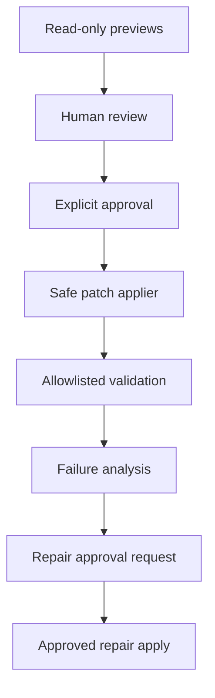

# RepoPilot Architecture Summary

RepoPilot is organized as a set of small deterministic layers. Each layer has a
clear responsibility and can be tested without running the whole system.

## High-Level Flow

## Module Responsibilities

### Repository Scanner

Location: `src/repopilot/repository/`

Validates a repository root, walks supported text files, ignores noisy folders,
skips binary or oversized files, and returns relative path metadata.

### Chunking

Location: `src/repopilot/chunking/`

Reads scanned text files and splits them into deterministic line-based chunks
with overlap. This prepares future retrieval and embeddings.

### Retrieval

Location: `src/repopilot/retrieval/`

Scores chunks using deterministic keyword overlap. It weights path matches more
heavily than text matches and returns ranked chunks with matched terms.

### Context Builder

Location: `src/repopilot/context/`

Composes scanning, chunking, and retrieval into one context preparation pipeline
for a user issue.

### Planner

Location: `src/repopilot/planning/`

Turns repository context into an `ImplementationPlan`. The deterministic planner
is used for safe previews. The LLM-backed planner uses an injected `LLMClient`.

### LLM Abstraction

Location: `src/repopilot/llm/`

Defines provider-independent request and response models plus an `LLMClient`
protocol. `FakeLLMClient` makes tests deterministic.

### Patch Proposal

Location: `src/repopilot/patching/`

Creates and validates structured patch proposals. LLM-backed proposal generation
parses JSON into the same Pydantic models and forces approval requirements.

### Safe Applier

Location: `src/repopilot/patching/applier.py`

Applies a proposal only after explicit approval. It validates paths, rejects
path traversal, checks current content against `original_content`, and validates
all changes before writing.

### Command Runner

Location: `src/repopilot/tools/commands.py`

Runs validation commands with `subprocess.run` and `shell=False`. Commands must
match an allowlist.

### Validation

Location: `src/repopilot/validation/`

Composes approved patch application with allowlisted command execution. It
returns structured validation checks.

### Failure Analysis

Location: `src/repopilot/validation/failure_analysis.py`

Summarizes failed validation checks into structured failure analysis for future
repair workflows.

### Repair Approval

Location: `src/repopilot/agent/`

Generates repair proposals through an injected LLM client and wraps them in an
approval request. It does not apply repairs automatically.

### Reporting

Location: `src/repopilot/reporting/` and reporting API modules

Turns workflow objects into structured reports and Markdown summaries. Reporting
endpoints are read-only and deterministic.

### API Layer

Location: `src/repopilot/api/` and `src/repopilot/schemas/`

Exposes safe FastAPI endpoints. Schemas define request and response contracts.
Routes stay thin and delegate to core layers.

## Safety Model

## Current API Surface

Read-only and demo:

- `GET /health`
- `GET /demo/workflow`
- `GET /report-demo`
- `GET /report-demo/markdown`

Repository previews:

- `POST /repositories/scan-summary`
- `POST /repositories/context-preview`
- `POST /repositories/plan-preview`
- `POST /repositories/patch-preview`

Approved mutation:

- `POST /patches/apply`
- `POST /patches/apply-and-validate`
- `POST /repairs/apply-approved`

Repair and analysis:

- `POST /validation/analyze-failures`
- `POST /repairs/approval-request`

Reporting:

- `POST /reports/repair-apply-result`
- `POST /reports/workflow`

## Extension Points

The next production-grade additions would be:

- real OpenAI or Anthropic clients behind `LLMClient`
- embeddings and vector search
- persistent run storage
- authentication and authorization
- audit logging
- frontend approval screens
- Docker deployment
- benchmark evaluations
